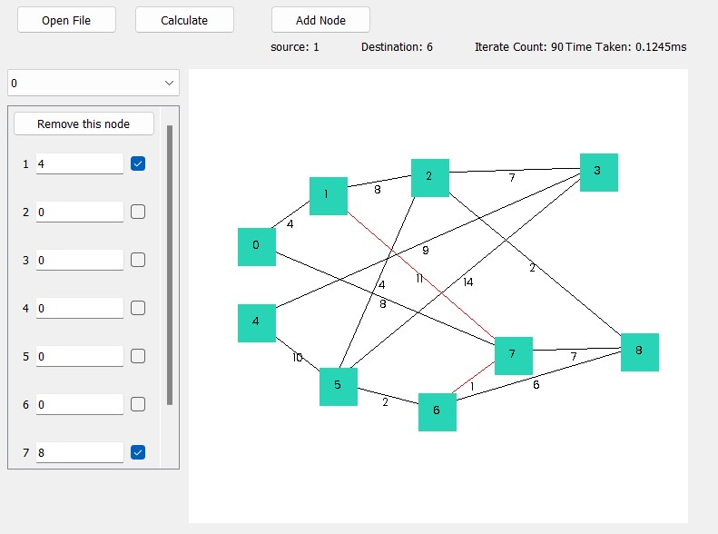

# Simple Map Implementation Using Dijkstra's Algorithm

> Terdapat beberapa node dalam sebuah graf. Cari lintasan terpendek dari sebuah node ke sebuah node lainnya dengan menggunakan algoritma Dijkstra.

## Deskripsi aplikasi

1. Dibuat menggunakan bahasa Python
2. Model graf dapat disimpan dalam format `txt` dalam bentuk adjacency matrix

## Fitur Tambahan

1. Fitur `Add Node`
2. Fitur `Remove Node`

## Cara Memakai

1. Download atau clone repo ini
2. Jalankan Windows PowerShell
3. Buka folder src repo ini
4. Buat Virtual Environment Python

    ```bash
    py -m venv venv
    ./venv/Scripts/Activate.ps1
    ```

5. Install library yang akan digunakan

    ```bash
    pip3 install -r requirements.txt
    ```

6. Pastikan library yang telah diinstall sudah sesuai

    ```bash
    pip freeze
    ```

7. Jalankan program

    ```bash
    py main.py
    ```

## Tampilan Aplikasi


